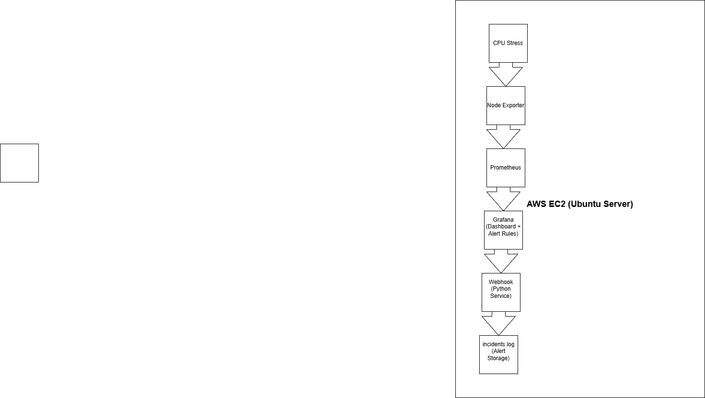
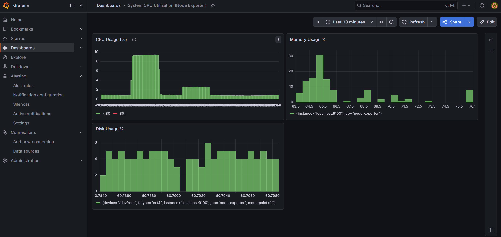
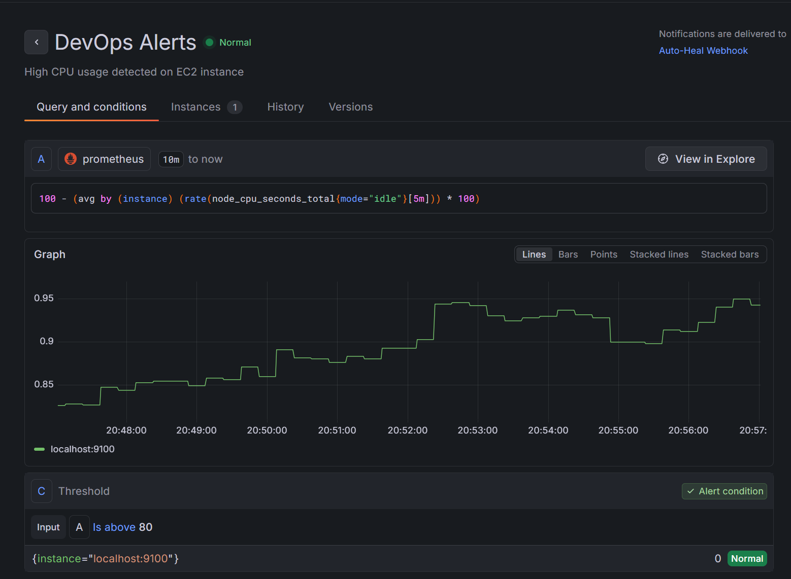
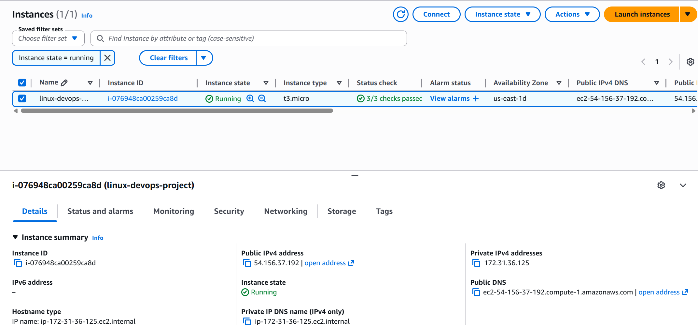
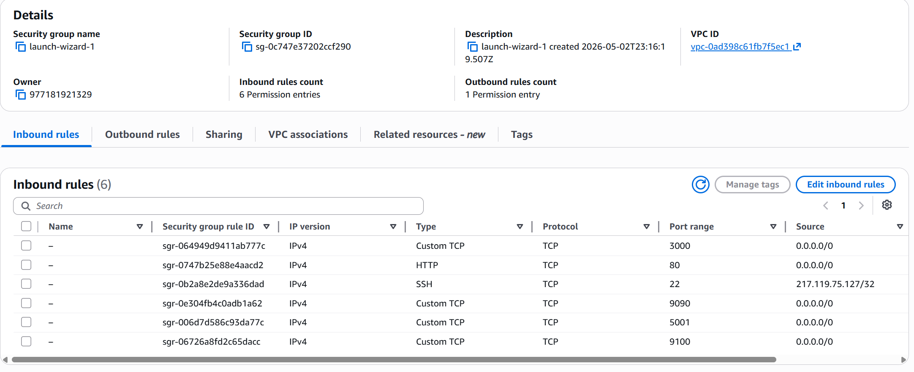
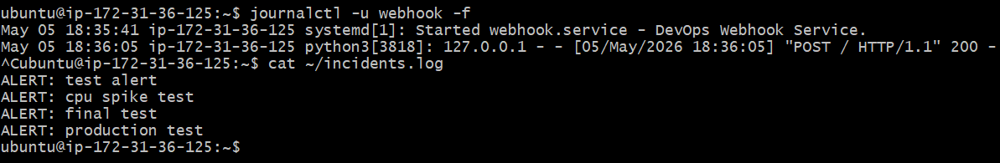
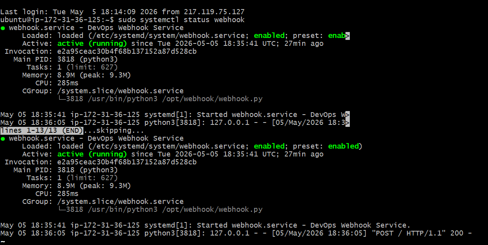

# DevOps Monitoring & Alerting System

## Overview
This project demonstrates a production-style monitoring and alerting system using **Prometheus, Grafana, and a Python webhook service running on AWS EC2 with systemd**.

The system monitors CPU usage and triggers alerts when thresholds are exceeded, simulating real-world observability and incident response workflows.

---

## Architecture

### System Flow
CPU Stress Test → Node Exporter → Prometheus → Grafana → Webhook → Incident Log

### Architecture Diagram

---

## Monitoring Workflow

- CPU stress is generated using `stress-ng`
- Node Exporter collects system metrics from the EC2 instance
- Prometheus scrapes metrics and evaluates alert rules
- Grafana visualizes metrics and triggers alerts
- Python webhook receives alert notifications
- Alerts are logged into `incidents.log` for tracking and auditing

---

## Features

- CPU monitoring using Node Exporter
- Grafana dashboards for real-time visualization
- Alerting rules for CPU threshold breaches
- Python webhook receiver for alert ingestion
- systemd service for production reliability
- Persistent incident logging system
- AWS EC2-based deployment

---

## Screenshots

### Grafana Dashboard

### Alert Rule (Firing State)

### AWS EC2 Instance

### Security Group Configuration

### Incident Logs

### Webhook Service Running

---

## Tech Stack

- AWS EC2 (Ubuntu)
- Linux
- Prometheus
- Grafana
- Python
- systemd
- Node Exporter
- stress-ng
